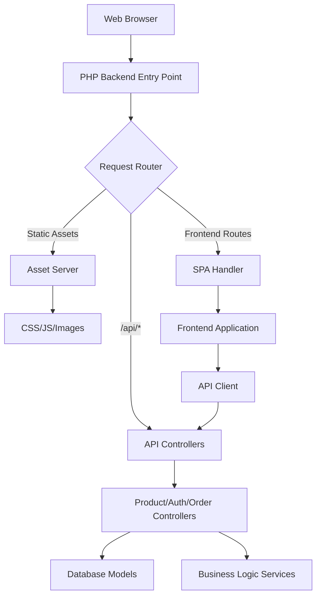

# Design Document: Frontend-Backend Integration

## Overview

This design addresses the reorganization and integration of the Riya Collections project, which currently has a complete PHP backend in `htdocs/` and a complete frontend in `riya-collections/frontend/`. The integration will create a unified application structure where the PHP backend serves both API endpoints and frontend assets, enabling seamless deployment and operation.

The current frontend is configured to connect to `http://localhost/htdocs/api` and contains comprehensive functionality including product browsing, user authentication, cart management, and order processing. The PHP backend provides a complete REST API with advanced routing, middleware, and comprehensive endpoint coverage.

## Architecture

### Current State Analysis

**PHP Backend (`htdocs/`):**
- Complete MVC architecture with controllers, models, services
- Advanced routing system with middleware support
- Comprehensive API endpoints for all application features
- Authentication and authorization systems
- File upload handling and image management
- Database integration with proper error handling
- Logging, monitoring, and performance optimization
- Environment configuration and deployment scripts

**Frontend (`riya-collections/frontend/`):**
- Complete single-page application with multiple pages
- Comprehensive JavaScript modules for API interaction
- Responsive design with accessibility features
- Asset management and optimization
- Configuration system for different environments
- Shopping cart, user authentication, and order management

### Target Architecture

The integrated architecture will follow a **PHP-Served Frontend** pattern where:

1. **Unified Entry Point**: PHP backend serves as the single entry point for all requests
2. **Asset Serving**: PHP backend serves frontend static assets with proper caching
3. **API Integration**: Frontend connects to backend APIs through the same domain
4. **Route Handling**: PHP handles both API routes and frontend SPA routing
5. **Environment Configuration**: Unified configuration for different deployment environments



## Components and Interfaces

### 1. Enhanced Router Component

**Purpose**: Extend the existing PHP router to handle frontend asset serving and SPA routing.

**Current State**: The existing `EnhancedRouter` class in `index.php` handles API routing with middleware support.

**Enhancements Needed**:
- Add static asset serving capabilities
- Implement SPA route handling for frontend navigation
- Add MIME type detection and caching headers
- Support for asset versioning and cache busting

**Interface**:
```php
class EnhancedRouter {
    // Existing API routing methods...
    
    public function serveStaticAsset($path): void;
    public function handleSPARoute($path): void;
    public function detectMimeType($file): string;
    public function setCacheHeaders($file): void;
}
```

### 2. Asset Server Component

**Purpose**: Serve frontend static assets through PHP with proper caching and compression.

**Responsibilities**:
- Serve CSS, JavaScript, images, and other static files
- Implement proper HTTP caching strategies
- Handle MIME type detection
- Support compression (gzip) when available
- Provide 404 handling for missing assets

**Interface**:
```php
class AssetServer {
    public function serve(string $assetPath): void;
    public function getCacheHeaders(string $file): array;
    public function compressOutput(string $content, string $mimeType): string;
    public function validateAssetPath(string $path): bool;
}
```

### 3. Frontend Configuration Manager

**Purpose**: Manage environment-specific configuration for the frontend application.

**Responsibilities**:
- Generate JavaScript configuration based on environment
- Handle API base URL configuration
- Manage feature flags and environment variables
- Provide configuration endpoint for frontend

**Interface**:
```php
class FrontendConfigManager {
    public function generateConfig(string $environment): array;
    public function getApiBaseUrl(): string;
    public function getFeatureFlags(): array;
    public function serveConfigEndpoint(): void;
}
```

### 4. SPA Route Handler

**Purpose**: Handle frontend single-page application routing.

**Responsibilities**:
- Serve main HTML file for SPA routes
- Distinguish between API and frontend routes
- Handle browser refresh on frontend routes
- Provide proper meta tags for SEO

**Interface**:
```php
class SPARouteHandler {
    public function handleRoute(string $path): void;
    public function isAPIRoute(string $path): bool;
    public function isFrontendRoute(string $path): bool;
    public function serveMainHTML(): void;
}
```

## Data Models

### Project Structure Model

The integrated project will follow this structure:

```
riya-collections-integrated/
├── public/                          # Web root directory
│   ├── index.php                   # Main entry point (enhanced)
│   ├── .htaccess                   # Apache configuration
│   ├── assets/                     # Frontend static assets
│   │   ├── css/                    # Stylesheets
│   │   ├── js/                     # JavaScript files
│   │   ├── images/                 # Image assets
│   │   └── fonts/                  # Font files
│   ├── pages/                      # Frontend HTML pages
│   └── uploads/                    # User uploaded files
├── app/                            # Application logic
│   ├── controllers/                # PHP controllers
│   ├── models/                     # Data models
│   ├── services/                   # Business logic
│   ├── middleware/                 # Request middleware
│   └── config/                     # Configuration files
├── storage/                        # Storage directory
│   ├── logs/                       # Application logs
│   ├── cache/                      # Cache files
│   └── backups/                    # Database backups
├── database/                       # Database related files
│   └── migrations/                 # Database migrations
├── tests/                          # Test files
├── deployment/                     # Deployment scripts
└── docs/                          # Documentation
```

### Configuration Data Model

```php
class IntegrationConfig {
    public string $environment;        // development, staging, production
    public string $apiBaseUrl;         // Base URL for API endpoints
    public string $frontendPath;       // Path to frontend assets
    public array $assetPaths;          // Mapping of asset types to paths
    public array $cacheSettings;      // Cache configuration
    public array $compressionSettings; // Compression settings
    public bool $debugMode;           // Debug mode flag
}
```

### Asset Mapping Model

```php
class AssetMapping {
    public array $mimeTypes;          // File extension to MIME type mapping
    public array $cacheRules;         // Cache duration by file type
    public array $compressionTypes;   // File types that support compression
    public array $securityHeaders;    // Security headers by file type
}
```

## Correctness Properties

*A property is a characteristic or behavior that should hold true across all valid executions of a system-essentially, a formal statement about what the system should do. Properties serve as the bridge between human-readable specifications and machine-verifiable correctness guarantees.*

Before defining the correctness properties, I need to analyze the acceptance criteria from the requirements document to determine which ones are testable as properties.

### Property 1: Backend Functionality Preservation
*For any* existing API endpoint, after integration the endpoint should return the same response format and status codes as before integration
**Validates: Requirements 1.4, 3.4**

### Property 2: Static Asset Serving with MIME Types
*For any* static asset file type (CSS, JS, images, fonts), the asset server should serve the file with the correct MIME type header
**Validates: Requirements 2.1, 2.3**

### Property 3: HTTP Caching for Static Assets
*For any* static asset request, the response should include appropriate cache headers based on the asset type
**Validates: Requirements 2.4, 6.1**

### Property 4: SPA Routing Functionality
*For any* frontend route path, the PHP backend should serve the main HTML application file to enable single-page application navigation
**Validates: Requirements 2.5, 4.1, 4.2**

### Property 5: Request Routing Logic
*For any* incoming request, the router should correctly distinguish between API requests, static asset requests, and frontend route requests, routing each to the appropriate handler
**Validates: Requirements 4.3, 4.4, 4.5**

### Property 6: API Connectivity and Error Handling
*For any* API request from the frontend, the request should connect to the correct backend endpoint and receive proper error responses with appropriate status codes when errors occur
**Validates: Requirements 3.2, 3.5**

### Property 7: Environment-Specific Configuration
*For any* deployment environment, the frontend application should automatically use the correct API base URL and configuration settings for that environment
**Validates: Requirements 5.4**

### Property 8: Asset Compression
*For any* compressible static asset, when the client supports compression, the asset should be served with appropriate compression encoding
**Validates: Requirements 6.2**

### Property 9: Cache Busting
*For any* static asset that changes, the asset should be served with updated versioning information to prevent stale cache issues
**Validates: Requirements 6.3**

### Property 10: Asset 404 Handling
*For any* request to a non-existent static asset, the server should return a proper 404 response with appropriate headers
**Validates: Requirements 6.4**

### Property 11: Error Logging
*For any* asset serving error that occurs, the error should be logged with sufficient detail for debugging purposes
**Validates: Requirements 6.5**

## Error Handling

### Asset Serving Errors

**Missing Assets**: When a requested asset doesn't exist, return HTTP 404 with proper headers and log the request for monitoring.

**Permission Errors**: When asset files can't be read due to permissions, return HTTP 403 and log security warnings.

**Corrupted Assets**: When asset files are corrupted or unreadable, return HTTP 500 and log error details.

### Configuration Errors

**Missing Configuration**: When environment configuration is missing, fall back to default development settings and log warnings.

**Invalid Configuration**: When configuration values are invalid, use safe defaults and log validation errors.

**Environment Detection Failures**: When environment can't be detected, default to development mode with appropriate logging.

### Routing Errors

**Ambiguous Routes**: When routes conflict between API and frontend, prioritize API routes and log conflicts.

**Invalid Paths**: When paths contain security risks (path traversal), reject with HTTP 400 and log security events.

**Middleware Failures**: When middleware fails, return appropriate HTTP status and log detailed error information.

### Integration Errors

**API Connectivity**: When frontend can't connect to backend APIs, provide user-friendly error messages and retry mechanisms.

**Asset Loading**: When frontend assets fail to load, provide fallback mechanisms and error reporting.

**Configuration Sync**: When frontend and backend configurations are out of sync, log warnings and use safe defaults.

## Testing Strategy

### Dual Testing Approach

The testing strategy employs both unit tests and property-based tests to ensure comprehensive coverage:

**Unit Tests** focus on:
- Specific configuration examples for different environments
- Individual asset serving scenarios
- Error condition handling
- Integration points between components

**Property-Based Tests** focus on:
- Universal properties that hold across all inputs
- Comprehensive coverage through randomized testing
- Verification of correctness properties defined above

### Property-Based Testing Configuration

- **Testing Library**: Use PHPUnit with custom property test generators
- **Minimum Iterations**: 100 iterations per property test
- **Test Tagging**: Each property test references its design document property
- **Tag Format**: **Feature: frontend-backend-integration, Property {number}: {property_text}**

### Unit Testing Balance

Unit tests complement property tests by covering:
- Specific environment configuration scenarios
- Edge cases in asset serving (empty files, large files, special characters)
- Error conditions and recovery mechanisms
- Integration between frontend and backend components

Property tests handle comprehensive input coverage through randomization, while unit tests focus on specific examples and integration scenarios.

### Test Categories

**Configuration Tests**:
- Verify environment-specific configuration loading
- Test configuration validation and fallback mechanisms
- Validate API base URL generation for different environments

**Asset Serving Tests**:
- Test MIME type detection for all supported file types
- Verify caching header generation
- Test compression for supported asset types
- Validate security measures (path traversal prevention)

**Routing Tests**:
- Test API route handling and middleware application
- Verify SPA route handling and HTML serving
- Test static asset route handling
- Validate route conflict resolution

**Integration Tests**:
- Test complete request/response cycles
- Verify frontend-backend API communication
- Test error propagation and handling
- Validate performance under load

**Property Test Examples**:
- **Feature: frontend-backend-integration, Property 1**: Backend functionality preservation
- **Feature: frontend-backend-integration, Property 2**: Static asset serving with MIME types
- **Feature: frontend-backend-integration, Property 3**: HTTP caching for static assets

Each property test will generate random inputs within valid ranges and verify that the specified property holds across all test cases.