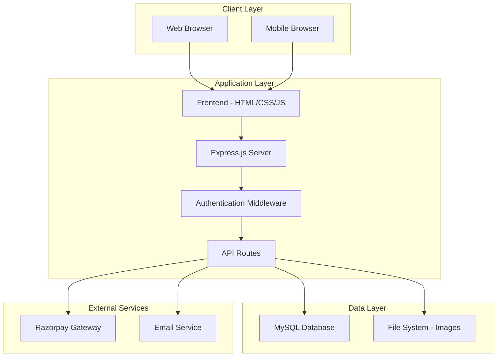

# Design Document: Riya Collections E-commerce Platform

## Overview

Riya Collections is a full-stack cosmetic e-commerce platform built with modern web technologies. The system follows a traditional three-tier architecture with a responsive frontend, RESTful API backend, and relational database. The platform emphasizes security, performance, and user experience while providing comprehensive administrative capabilities.

The system serves two primary user types: customers who browse and purchase products, and administrators who manage inventory, orders, and platform operations. The architecture supports scalability and maintainability through modular design and clear separation of concerns.

## Architecture

### System Architecture



### Technology Stack

**Frontend:**
- HTML5 for semantic structure
- CSS3 with Flexbox/Grid for responsive layouts
- Vanilla JavaScript for interactivity and API communication
- No external frameworks to minimize dependencies

**Backend:**
- Node.js runtime environment
- Express.js web framework
- JWT for authentication
- bcrypt for password hashing
- Multer for file uploads

**Database:**
- MySQL for relational data storage
- Structured schema with proper foreign key relationships
- Optimized indexes for query performance

**External Integrations:**
- Razorpay for payment processing
- SMTP for email notifications
- Hostinger-compatible deployment structure

## Components and Interfaces

### Frontend Components

**1. Customer Interface**
- **Home Page**: Hero section, featured products, category navigation
- **Product Catalog**: Grid layout with filtering and sorting capabilities
- **Product Detail**: Image gallery, specifications, add-to-cart functionality
- **Shopping Cart**: Item management, quantity updates, coupon application
- **Checkout**: Multi-step process with address and payment selection
- **User Account**: Profile management, order history, tracking

**2. Admin Interface**
- **Dashboard**: Overview of orders, products, and system metrics
- **Product Management**: CRUD operations with image upload
- **Order Management**: Status updates and customer communication
- **User Management**: Customer account oversight
- **Inventory Control**: Stock levels and pricing management

### Backend API Endpoints

**Authentication Endpoints:**
```
POST /api/auth/register - Customer registration
POST /api/auth/login - Customer/Admin login
POST /api/auth/logout - Session termination
GET /api/auth/profile - User profile retrieval
PUT /api/auth/profile - Profile updates
```

**Product Endpoints:**
```
GET /api/products - Product listing with filters
GET /api/products/:id - Individual product details
POST /api/admin/products - Create new product (Admin)
PUT /api/admin/products/:id - Update product (Admin)
DELETE /api/admin/products/:id - Remove product (Admin)
POST /api/admin/products/:id/images - Upload product images (Admin)
```

**Cart and Order Endpoints:**
```
GET /api/cart - Retrieve cart contents
POST /api/cart/add - Add item to cart
PUT /api/cart/update - Update cart quantities
DELETE /api/cart/remove - Remove cart items
POST /api/orders - Create new order
GET /api/orders - Order history
GET /api/orders/:id - Order details
PUT /api/admin/orders/:id/status - Update order status (Admin)
```

**Payment Endpoints:**
```
POST /api/payments/razorpay/create - Initialize Razorpay payment
POST /api/payments/razorpay/verify - Verify payment signature
POST /api/payments/cod - Process Cash on Delivery
```

### Database Interfaces

**Core Entity Relationships:**
- Users have many Orders
- Orders contain many OrderItems
- Products belong to Categories
- Orders have one Payment record
- Users have many Addresses

**Key Database Operations:**
- Product inventory management with stock validation
- Order status workflow enforcement
- User authentication and session management
- Payment transaction recording
- Image metadata storage and retrieval

## Data Models

### Database Schema

**Users Table:**
```sql
CREATE TABLE users (
    id INT PRIMARY KEY AUTO_INCREMENT,
    email VARCHAR(255) UNIQUE NOT NULL,
    password_hash VARCHAR(255) NOT NULL,
    first_name VARCHAR(100) NOT NULL,
    last_name VARCHAR(100) NOT NULL,
    phone VARCHAR(20),
    created_at TIMESTAMP DEFAULT CURRENT_TIMESTAMP,
    updated_at TIMESTAMP DEFAULT CURRENT_TIMESTAMP ON UPDATE CURRENT_TIMESTAMP
);
```

**Admins Table:**
```sql
CREATE TABLE admins (
    id INT PRIMARY KEY AUTO_INCREMENT,
    email VARCHAR(255) UNIQUE NOT NULL,
    password_hash VARCHAR(255) NOT NULL,
    name VARCHAR(100) NOT NULL,
    role ENUM('admin', 'super_admin') DEFAULT 'admin',
    created_at TIMESTAMP DEFAULT CURRENT_TIMESTAMP
);
```

**Categories Table:**
```sql
CREATE TABLE categories (
    id INT PRIMARY KEY AUTO_INCREMENT,
    name VARCHAR(100) NOT NULL,
    description TEXT,
    image_url VARCHAR(255),
    is_active BOOLEAN DEFAULT TRUE,
    created_at TIMESTAMP DEFAULT CURRENT_TIMESTAMP
);
```

**Products Table:**
```sql
CREATE TABLE products (
    id INT PRIMARY KEY AUTO_INCREMENT,
    name VARCHAR(255) NOT NULL,
    description TEXT,
    price DECIMAL(10,2) NOT NULL,
    stock_quantity INT NOT NULL DEFAULT 0,
    category_id INT,
    brand VARCHAR(100),
    sku VARCHAR(50) UNIQUE,
    is_active BOOLEAN DEFAULT TRUE,
    created_at TIMESTAMP DEFAULT CURRENT_TIMESTAMP,
    updated_at TIMESTAMP DEFAULT CURRENT_TIMESTAMP ON UPDATE CURRENT_TIMESTAMP,
    FOREIGN KEY (category_id) REFERENCES categories(id)
);
```

**Product Images Table:**
```sql
CREATE TABLE product_images (
    id INT PRIMARY KEY AUTO_INCREMENT,
    product_id INT NOT NULL,
    image_url VARCHAR(255) NOT NULL,
    alt_text VARCHAR(255),
    is_primary BOOLEAN DEFAULT FALSE,
    sort_order INT DEFAULT 0,
    FOREIGN KEY (product_id) REFERENCES products(id) ON DELETE CASCADE
);
```

**Addresses Table:**
```sql
CREATE TABLE addresses (
    id INT PRIMARY KEY AUTO_INCREMENT,
    user_id INT NOT NULL,
    type ENUM('home', 'work', 'other') DEFAULT 'home',
    first_name VARCHAR(100) NOT NULL,
    last_name VARCHAR(100) NOT NULL,
    address_line1 VARCHAR(255) NOT NULL,
    address_line2 VARCHAR(255),
    city VARCHAR(100) NOT NULL,
    state VARCHAR(100) NOT NULL,
    postal_code VARCHAR(20) NOT NULL,
    country VARCHAR(100) DEFAULT 'India',
    phone VARCHAR(20),
    is_default BOOLEAN DEFAULT FALSE,
    FOREIGN KEY (user_id) REFERENCES users(id) ON DELETE CASCADE
);
```

**Orders Table:**
```sql
CREATE TABLE orders (
    id INT PRIMARY KEY AUTO_INCREMENT,
    user_id INT NOT NULL,
    order_number VARCHAR(50) UNIQUE NOT NULL,
    status ENUM('placed', 'processing', 'shipped', 'out_for_delivery', 'delivered', 'cancelled') DEFAULT 'placed',
    total_amount DECIMAL(10,2) NOT NULL,
    discount_amount DECIMAL(10,2) DEFAULT 0,
    shipping_amount DECIMAL(10,2) DEFAULT 0,
    tax_amount DECIMAL(10,2) DEFAULT 0,
    coupon_code VARCHAR(50),
    shipping_address_id INT NOT NULL,
    payment_method ENUM('razorpay', 'cod') NOT NULL,
    payment_status ENUM('pending', 'paid', 'failed', 'refunded') DEFAULT 'pending',
    notes TEXT,
    created_at TIMESTAMP DEFAULT CURRENT_TIMESTAMP,
    updated_at TIMESTAMP DEFAULT CURRENT_TIMESTAMP ON UPDATE CURRENT_TIMESTAMP,
    FOREIGN KEY (user_id) REFERENCES users(id),
    FOREIGN KEY (shipping_address_id) REFERENCES addresses(id)
);
```

**Order Items Table:**
```sql
CREATE TABLE order_items (
    id INT PRIMARY KEY AUTO_INCREMENT,
    order_id INT NOT NULL,
    product_id INT NOT NULL,
    quantity INT NOT NULL,
    unit_price DECIMAL(10,2) NOT NULL,
    total_price DECIMAL(10,2) NOT NULL,
    FOREIGN KEY (order_id) REFERENCES orders(id) ON DELETE CASCADE,
    FOREIGN KEY (product_id) REFERENCES products(id)
);
```

**Payments Table:**
```sql
CREATE TABLE payments (
    id INT PRIMARY KEY AUTO_INCREMENT,
    order_id INT NOT NULL,
    payment_method ENUM('razorpay', 'cod') NOT NULL,
    payment_status ENUM('pending', 'completed', 'failed', 'refunded') DEFAULT 'pending',
    amount DECIMAL(10,2) NOT NULL,
    razorpay_payment_id VARCHAR(255),
    razorpay_order_id VARCHAR(255),
    razorpay_signature VARCHAR(255),
    transaction_id VARCHAR(255),
    created_at TIMESTAMP DEFAULT CURRENT_TIMESTAMP,
    updated_at TIMESTAMP DEFAULT CURRENT_TIMESTAMP ON UPDATE CURRENT_TIMESTAMP,
    FOREIGN KEY (order_id) REFERENCES orders(id)
);
```

**Coupons Table:**
```sql
CREATE TABLE coupons (
    id INT PRIMARY KEY AUTO_INCREMENT,
    code VARCHAR(50) UNIQUE NOT NULL,
    description VARCHAR(255),
    discount_type ENUM('percentage', 'fixed') NOT NULL,
    discount_value DECIMAL(10,2) NOT NULL,
    minimum_amount DECIMAL(10,2) DEFAULT 0,
    maximum_discount DECIMAL(10,2),
    usage_limit INT,
    used_count INT DEFAULT 0,
    is_active BOOLEAN DEFAULT TRUE,
    valid_from TIMESTAMP DEFAULT CURRENT_TIMESTAMP,
    valid_until TIMESTAMP,
    created_at TIMESTAMP DEFAULT CURRENT_TIMESTAMP
);
```

### Data Validation Rules

**User Data:**
- Email must be valid format and unique
- Password minimum 8 characters with complexity requirements
- Phone numbers validated for Indian format
- Names must contain only alphabetic characters and spaces

**Product Data:**
- Price must be positive decimal with 2 decimal places
- Stock quantity must be non-negative integer
- SKU must be unique across all products
- Product names must be between 3-255 characters

**Order Data:**
- Order numbers generated with timestamp and random component
- Status transitions must follow defined workflow
- Amounts must be positive and match calculated totals
- Payment verification required for Razorpay transactions

**Image Data:**
- Supported formats: JPEG, PNG, WebP
- Maximum file size: 5MB per image
- Automatic optimization and thumbnail generation
- Secure file naming to prevent conflicts

## Correctness Properties

*A property is a characteristic or behavior that should hold true across all valid executions of a system—essentially, a formal statement about what the system should do. Properties serve as the bridge between human-readable specifications and machine-verifiable correctness guarantees.*

### Property 1: User Registration and Authentication
*For any* valid user registration data, the system should create a new account with properly encrypted password storage and enable successful authentication with the provided credentials
**Validates: Requirements 1.1, 1.2**

### Property 2: Authentication Rejection
*For any* invalid credentials (wrong password, non-existent email, or malformed data), the authentication system should reject access and return appropriate error messages
**Validates: Requirements 1.3**

### Property 3: Profile Data Consistency
*For any* authenticated user, accessing their profile should return their complete personal information and order history, and valid profile updates should be saved correctly
**Validates: Requirements 1.4, 1.5**

### Property 4: Product Display Completeness
*For any* product in the system, both catalog listings and detail pages should display all required information including images, names, prices, stock status, and comprehensive product details
**Validates: Requirements 2.1, 2.6**

### Property 5: Product Filtering and Search
*For any* filter criteria (category, price range) or search terms, the system should return only products that match the specified criteria
**Validates: Requirements 2.2, 2.3, 2.5**

### Property 6: Product Sorting
*For any* sort criteria (price, popularity), the system should reorder product displays in the correct ascending or descending order
**Validates: Requirements 2.4**

### Property 7: Cart Operations
*For any* valid cart operation (add, update, remove), the system should correctly update cart contents, recalculate totals, and validate stock availability
**Validates: Requirements 3.1, 3.2**

### Property 8: Coupon Application
*For any* valid coupon code, the system should calculate and apply the correct discount amount according to the coupon's rules
**Validates: Requirements 3.3**

### Property 9: Checkout Validation
*For any* checkout attempt, the system should validate cart contents, stock availability, address information, and payment method selection
**Validates: Requirements 3.4, 3.5, 3.6**

### Property 10: Payment Processing Integration
*For any* payment attempt, the system should correctly integrate with Razorpay for online payments or handle Cash on Delivery orders appropriately
**Validates: Requirements 4.1, 4.4**

### Property 11: Order Creation Consistency
*For any* successful payment or COD selection, the system should create an order with unique ID, correct initial status, and send confirmation notifications
**Validates: Requirements 4.2, 5.1**

### Property 12: Payment Failure Handling
*For any* failed payment attempt, the system should maintain cart state and display appropriate error messages without creating incomplete orders
**Validates: Requirements 4.3**

### Property 13: Data Encryption
*For any* sensitive data (passwords, payment information), the system should encrypt the data before storage using appropriate encryption methods
**Validates: Requirements 4.5, 6.5, 9.3**

### Property 14: Order Status Workflow
*For any* order status change, the system should enforce valid status transitions (Placed → Processing → Shipped → Out for Delivery → Delivered) and reject invalid transitions
**Validates: Requirements 5.3, 8.5**

### Property 15: Order Status Notifications
*For any* order status update, the system should notify the customer via email with updated tracking information
**Validates: Requirements 5.2, 8.2**

### Property 16: Order Information Display
*For any* order, both customer order history and admin order details should display complete information including products, quantities, status, and addresses
**Validates: Requirements 5.4, 5.5, 8.1, 8.4**

### Property 17: Admin Authentication and Access Control
*For any* admin authentication attempt, the system should verify credentials correctly and enforce role-based access control for administrative functions
**Validates: Requirements 6.1, 6.3**

### Property 18: Session Management
*For any* expired admin session, the system should require re-authentication and log unauthorized access attempts
**Validates: Requirements 6.2, 6.4**

### Property 19: Product Management Operations
*For any* admin product operation (create, update, delete), the system should validate the data, update the database correctly, and handle image uploads appropriately
**Validates: Requirements 7.1, 7.3, 7.5**

### Property 20: Image Upload and Optimization
*For any* product image upload, the system should validate file types and sizes, optimize images for web display, and store them securely
**Validates: Requirements 7.2, 13.1, 13.2, 13.3, 13.4**

### Property 21: Stock Management
*For any* stock quantity update, the system should immediately reflect changes in customer-facing displays and prevent overselling
**Validates: Requirements 7.4**

### Property 22: Admin Order Search
*For any* admin order search query (by order ID, customer name, or date range), the system should return all matching orders with complete information
**Validates: Requirements 8.3**

### Property 23: Input Validation and Security
*For any* user input, the system should validate, sanitize, and use parameterized queries to prevent SQL injection attacks
**Validates: Requirements 9.1, 9.2, 9.5**

### Property 24: HTTPS Communication
*For any* data transmission, the system should use HTTPS to ensure secure communication
**Validates: Requirements 9.4**

### Property 25: Database Integrity
*For any* database operation, the system should maintain referential integrity through foreign key constraints and handle concurrent access safely
**Validates: Requirements 10.1, 10.2, 10.3**

### Property 26: Query Performance
*For any* database query, the system should utilize appropriate indexes for optimal performance
**Validates: Requirements 10.4**

### Property 27: Responsive Design
*For any* screen size (mobile, tablet, desktop), the system should display correctly with appropriate layout adaptations
**Validates: Requirements 11.1**

### Property 28: Animation Performance
*For any* user interface interaction, the system should provide smooth CSS animations and transitions without errors
**Validates: Requirements 11.3**

### Property 29: Page Load Performance
*For any* page request, the system should load within acceptable time limits using optimized images and efficient code
**Validates: Requirements 11.4**

### Property 30: Email Notification System
*For any* order event (placement, status change, payment confirmation), the system should send appropriately formatted emails with complete information and handle delivery failures gracefully
**Validates: Requirements 12.1, 12.2, 12.3, 12.4, 12.5**

### Property 31: Image Gallery Functionality
*For any* product with multiple images, the system should provide functional gallery navigation and display capabilities
**Validates: Requirements 13.5**

### Property 32: Configuration Management
*For any* system configuration, the system should read values from environment variables correctly
**Validates: Requirements 14.2**

### Property 33: Error Handling
*For any* system error in production, the system should handle it gracefully without exposing sensitive information
**Validates: Requirements 14.4**

### Property 34: Database Migration
*For any* initial system setup, the database migration scripts should execute successfully and create the required schema
**Validates: Requirements 14.5**

## Error Handling

### Client-Side Error Handling

**Form Validation:**
- Real-time validation for email formats, password strength, and required fields
- Clear error messages displayed inline with form fields
- Prevention of form submission with invalid data
- User-friendly error messaging without technical jargon

**Network Error Handling:**
- Graceful handling of network timeouts and connection failures
- Retry mechanisms for failed API requests
- Loading states and progress indicators for long operations
- Offline detection and appropriate user messaging

**Payment Error Handling:**
- Clear messaging for payment failures with suggested actions
- Preservation of cart state during payment errors
- Fallback to alternative payment methods when available
- Secure handling of payment gateway error responses

### Server-Side Error Handling

**Input Validation Errors:**
- Comprehensive validation of all incoming data
- Sanitization of user inputs to prevent XSS attacks
- Structured error responses with appropriate HTTP status codes
- Logging of validation failures for security monitoring

**Database Error Handling:**
- Transaction rollback on operation failures
- Connection pool management and recovery
- Graceful handling of constraint violations
- Data integrity checks before critical operations

**External Service Errors:**
- Timeout handling for payment gateway communications
- Fallback mechanisms for email service failures
- Circuit breaker patterns for external API calls
- Comprehensive logging of external service interactions

**Authentication and Authorization Errors:**
- Secure handling of authentication failures
- Rate limiting for login attempts
- Session timeout management
- Audit logging for security events

### Error Logging and Monitoring

**Structured Logging:**
- Consistent log format across all application components
- Appropriate log levels (ERROR, WARN, INFO, DEBUG)
- Correlation IDs for tracking requests across services
- Sensitive data exclusion from log outputs

**Error Categorization:**
- Business logic errors vs. system errors
- User-correctable errors vs. system administrator errors
- Critical errors requiring immediate attention
- Performance degradation indicators

## Testing Strategy

### Dual Testing Approach

The testing strategy employs both unit testing and property-based testing to ensure comprehensive coverage and correctness validation.

**Unit Testing Focus:**
- Specific examples demonstrating correct behavior
- Edge cases and boundary conditions
- Error conditions and exception handling
- Integration points between components
- Mock external dependencies for isolated testing

**Property-Based Testing Focus:**
- Universal properties that hold across all valid inputs
- Comprehensive input coverage through randomization
- Invariant validation across system operations
- Round-trip properties for data serialization
- Metamorphic properties for complex business logic

### Property-Based Testing Configuration

**Testing Framework:** fast-check for JavaScript property-based testing
- Minimum 100 iterations per property test to ensure statistical confidence
- Custom generators for domain-specific data types (users, products, orders)
- Shrinking capabilities to find minimal failing examples
- Deterministic test execution with configurable seeds

**Test Organization:**
- Each correctness property implemented as a single property-based test
- Test tags referencing design document properties
- Tag format: **Feature: riya-collections, Property {number}: {property_text}**
- Grouped test suites by functional area (authentication, cart, orders, etc.)

**Data Generation Strategy:**
- Realistic test data generation matching production patterns
- Edge case inclusion in generators (empty strings, boundary values, special characters)
- Constraint-aware generation (valid email formats, positive prices, stock quantities)
- Stateful testing for complex workflows (cart operations, order processing)

### Unit Testing Strategy

**Component Testing:**
- Individual function and method validation
- Database operation testing with test database
- API endpoint testing with mock requests
- Frontend component testing with DOM manipulation validation

**Integration Testing:**
- End-to-end workflow testing (registration to order completion)
- Payment gateway integration testing with sandbox environments
- Email service integration testing with test email providers
- File upload and image processing pipeline testing

**Security Testing:**
- SQL injection prevention validation
- XSS attack prevention testing
- Authentication bypass attempt testing
- Authorization boundary testing

### Test Environment Management

**Database Testing:**
- Separate test database with identical schema
- Test data seeding and cleanup between tests
- Transaction isolation for concurrent test execution
- Database migration testing for schema changes

**External Service Mocking:**
- Payment gateway mock responses for various scenarios
- Email service mocking for notification testing
- File system mocking for image upload testing
- Network failure simulation for error handling validation

**Performance Testing:**
- Load testing for concurrent user scenarios
- Database query performance validation
- Image optimization performance testing
- Memory usage monitoring during test execution

### Continuous Integration

**Automated Test Execution:**
- All tests run on every code commit
- Property-based tests with fixed seeds for reproducibility
- Test result reporting with coverage metrics
- Failed test notification and debugging information

**Test Coverage Requirements:**
- Minimum 80% code coverage for unit tests
- 100% property coverage for all correctness properties
- Critical path coverage for all user workflows
- Security test coverage for all input validation points